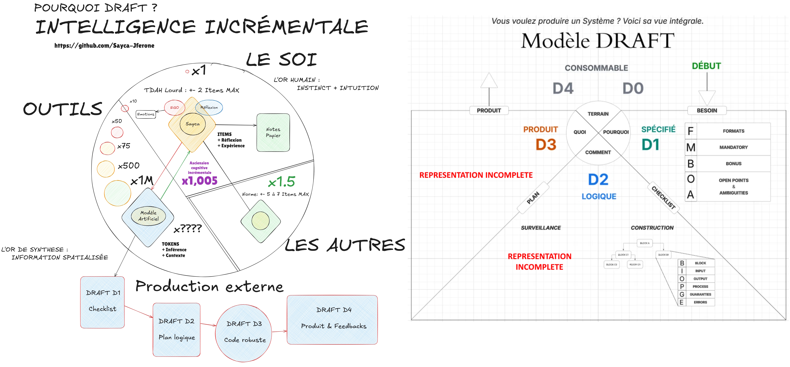

# Programmation par Architecture Contractuelle Traçable

#### Update : v0.52 (09/05/2026)

Avec ou sans LLM, le coût réel n'est plus le temps à écrire du code, mais bien celui de concevoir et débuguer une solution sans référentiel, à déconstruire sans architecture, à re/partir de zéro sans avoir éliminé le flou et identifié les failles de conception.

## QUI devrait utiliser PACT ?

| | |
|---|---|
| Étudiants 42 | Le pari est de **"ne jamais retravailler deux fois la même chose"**. On sauve le temps, la clarté, les compétences acquises et la capacité à raisonner plus complexe. |
| Ingénieurs logiciels | Au-delà de vos maîtrises et expériences, vos projets en solo & petites équipes (testé de 1 à 3) profitent d'un pipeline malléable, rétro-phasable en cas de problèmes inopinés en fonctionnement. |

### Apprentissage procédurier & Capacité à produire

### [NOUVEAU] Préambule de DRAFT (remplaçant de PACT)




## QUAND utiliser PACT ?

```txt
A - Phase I obligatoire : synthétiser et corriger le sujet (42, demande client, idée/concept). Se renforce avec les feedbacks I/II/III pour versions ultérieures.

B - Nombre d'interfaces non triviales ?
   Phase II
   └─ <=1 → sauter la Phase II pour III
   └─ 2-3 → schéma libre en ≈II
   └─ >=4 → BIOPGE

C - Ambiguïté du problème ?
   └─ Nulle (spec complète) → descend d'un niveau
   └─ Partielle → maintient le niveau
   └─ Forte → monte d'un niveau + Phase I obligatoire

D - Irréversibilité des décisions clés ?
   └─ Faible → descend d'un niveau
   └─ Forte → maintient ou monte
```

## QU'EST-CE que PACT ?

### Un fiabilisateur cognitif. Plus de temps en Phase I-II pour économiser en Phase III

**Sur quoi ?** -> **Tous vos sujets. Pas d'over-engineering :** Un petit programme demandera quelques minutes de Phases I & II. Pour les plus complexes, on parle de jours, semaines ou mois.

**Pourquoi ?** -> J'estime que ma mémoire de travail limitée m'impose de déconstruire les problèmes et détecter les incohérences des sujets avant de les découvrir le nez dans le code.

1. **Réduire le temps de travail**, la fatigue du développeur par l'entropie `Mental<->Concept<->Produit`.
2. **Renforcer la cohérence** du système avec une remontée des debugs en entonnoir `I<-II<-III`.
3. **Référentiel lisible** pour les changements de features / souhaits-clients en cours de dev.

Le code devient une traduction d'un contrat existant, et non une exploration in-code comme je le faisais autrefois.

| Phase | Produit | Nature | Cadre | Utilité |
|---|---|---|---|---|
| O | Sujet, Marché, Demande | Quand on vous fournit un sujet, passez le au crible dans la Phase I afin d'épurer la requête. | Abstrait | Besoin brut de solution logicielle |
| I | `1-CheckList.md` | La to-do-list, le comportement du produit. Explication corrigée du contexte avec to-do list intégrale | Formel | Besoin corrigé, clair, épuré, comportements listés |
| II | `2-Architecture.md` | Architecture intermédiaire entre le mental et le livrable | Formel | Débugguer des blocs logiques, pas des blocs codés |
| III | `3-DebugNotes.md` & `système en marche` | Système consommable et notes in-dev optionnelles | Concret | Traduire la logique débugguée en code à debug en environnement réel |

---

## Les 3 phases

### Phase I : Check List 📝

- **Option avec assistant LLM:** Lancer une session de Questions-Réponses où le développeur doit répondre sur les `points de compréhension du sujet, ses compétences de développement à avoir dans le language concerné, points sensibles du sujet`.

Lire le problème, le décomposer, et lister :

- **1. Formats (F-XX)** : langage, normes, contraintes, livrables.
- **2. Mandatory (M-XX)** : ce que le sujet exige explicitement.
- **3. Bonus (B-XX)** : ce qui est optionnel.
- **4. Open-To (O-XX)** : les choix et libertés laissés au développeur.
- **5. Ambiguities (A-XX)** : les zones grises, à résoudre ou assumer.

Sortie : `1-SYNTHESIS.md`. Une to-do list avec cases à cocher, dense, lisible en 60 secondes.

Si le client change souvent d'avis, si la version d'un système par conception doit changer, ça se fait ici. Ensuite, on propage sur Phase II, puis on implémente en Phase III.

### Phase II : Architecture 📐

**Avant d'écrire la première ligne de code**, chaque fichier reçoit un **bloc BIOPGE** (Boundary-Inputs-Outputs-Process-Guarantees-Errors)

```markdown
### `src/file.format`

> Covers: M-02, B-14, O-2   ((OPTIONNEL))

> Author: jferone [resp], patoche [contrib]   ((OPTIONNEL))

| Champ | Contenu |
|---|---|
| **Boundary** | Nom du fichier, auteur, ce que cette unité possède (et ce qu'elle ne possède pas). |
| **Inputs** | Paramètres typés. Pas d'ambiguïté. |
| **Outputs** | Retours typés ou effets de bord. |
| **Process** | Étapes numérotées ou en prose par séquences fléches. |
| **Guarantees** | Invariants vérifiables après exécution. |
| **Errors** | Chaque mode d'échec, son déclencheur, son comportement. |
```

Sortie : `2-Architecture.md`. Un tableau de cette forme par bloc-fichier, possible de l'étendre en sous-parties selon votre volonté, si utile.

**Règle : pas de code tant que le bloc BIOPGE concerné n'est pas défini. Même défaillant, on peut sortir du code pour corriger la logique BIOPGE, et revenir.**

#### Exemple tiré d'un projet 42next - A-Maze-ing (2-peers)

```markdown
### /renderer.py
|  |  |
|---|---|
| Boundary | `renderer.py` - jferone [resp], elocufie [contrib] - Live UX & raw maze translator to ASCII/ANSI.
| Inputs | `grid: list[list[int]]` ; `path: list[tuple[int,int]] \| None` ; `entry: tuple[int,int]` ; `exit_: tuple[int,int]` ; `config: dict[str, Any]`
| Outputs | stdout ANSI terminal rendering
| Process | iterate cells -> draw North+West walls per cell via ANSI codes ; mark entry cell and exit cell with distinct symbols ; if `path` not None: highlight path cells ; numbered menu: 1 re-gen ; 2 show/hide path ; 3 rotate wall colors ; 4 quit
| Guarantees | display consistent with grid ; shared walls drawn exactly once ; entry and exit always visually distinct ; all 4 menu interactions functional ; `path=None` renders maze without path overlay, no crash
| Errors | terminal too small -> warning message, no crash
```

**ATTENTION:** Si un bug conceptuel est relevé dans l'un des blocs, on retourne en Phase II. Pire s'il s'agit de la forme du programme entier, on court-circuite en Phase I, puis Phase II, puis Phase III.

---

### Phase III : Implementation 🏗️

Le contrat existe. Il suffit de le traduire en code, dans votre syntaxe et dans vos normes.

Pendant l'écriture, deux types d'erreurs possibles :

1. **Erreur syntaxique** *(typo, import, off-by-one, non-native in language)* : on corrige sur place.
2. **Erreur logique** *(flux incorrect, garantie impossible, cas oublié)* : on retourne en Phase II, on amende le bloc, on re-valide.

Cette distinction est la règle critique de Phase III. La confondre, c'est accumuler de la dette invisible.

Sortie : un produit quelconque, du code auditable, où chaque fonction trace jusqu'à un bloc BIOPGE Phase II, la synthèse Phase I est cochée en intégralité.

`3-DebugNotes.md` est le journal optionnel du développeur, mis à jour au fil de l'eau : décisions non triviales, ressources consultées, retroactivités. Il complète les commits git, il ne les remplace pas.

---

## Le triplet livré

À la fin d'un projet construit/modifié sous PACT, le dépôt contient par exemple :

```
[livrables]
src/
	[code source]
docs/devnotes/
              0-Subject.pdf       # exemple d'une ressource client
              1-CheckList.md      # le problème lisible en 60 secondes
              2-Architecture.md   # le contrat d'architecture lisible et traductible en code corrigé
              3-DebugNotes.md     # le journal du développeur, feedbacks optionnels de code/debug
              [schémas, ...]
```

Ce dépôt de base suffit à lui-seul pour la rédaction d'un `README.md` final cohérent (utile pour les rendus inspectés ou tout dépôt public).

---

## Rétroactivité

Chaque phase peut renvoyer à la précédente :

```

Phase O  (Problème/Demande) <----- audit si flou ------+  <( Consommateur de la Solution Système
   |                                                   |
   v                                                   |
Phase I  (Check List)       <--- clarifier le sujet ---+  <( Référentiel: normes/forme/comportements
   |                                                   |
   v                                                   |
Phase II (ARCH. Logique)    <----- erreur logique -----+  <( Debug de la qualité du système
   |                                                   |
   v                                                   |
Phase III (ARCH. Codée)     ------ erreur syntaxe -----+  <( Debug du Support Sys. (software/hardware)
```

Retourner en arrière n'est pas un échec. C'est le protocole qui filtre une mauvaise compréhension ou une mauvaise architecture au stade le moins coûteux.

---

## Comment l'utiliser

1. Copier les templates de `1-CheckList.md` et `2-Architecture.md` à la racine du projet (ou dans `docs/devnotes/`).
2. Faire la Phase I jusqu'à ce qu'aucune question ouverte ne puisse invalider l'architecture.
3. Remplir chaque bloc BIOPGE en Phase II. Valider avant tout code.
4. Coder en Phase III. Ne retourner en Phase II que sur erreur logique.

Les templates exacts et les règles de chaque phase sont dans les Claude AI Skills `pact-phase1`, `pact-phase2`, `pact-phase3` (utilisables avec un LLM compagnon, applicable à la lettre par un humain) ou directement dans les sections du présent dépôt.

---

### Ancêtres et cousins

PACT converge avec trois standards/méthodes déjà établies, dont j'ai découvert la proximité pendant l'audit technique du protocole :

| Référence | Domaine | Ressemblance avec PACT | Différence clé |
|---|---|---|---|
| **Design by Contract** (Meyer, 1986) | Génie logiciel formel | **Bloc BIOPGE = contrat au sens Meyer** : pre/post/invariant/error mapping direct | DbC opère au niveau fonction/classe ; PACT systématise au niveau fichier/module + impose une phase conceptuelle en amont (Phase I) |
| **arc42** (Starke & Hruschka, 2005) | Documentation d'architecture | **Format markdown structuré** ; compartiments optionnels ; pragmatisme "tell, don't show" | arc42 couvre 12 aspects d'architecture (contexte, décisions, qualité, risques) ; PACT restreint à contrats de fichier → code et synthèse conceptuelle |
| **Spec-Driven Development** (GitHub Spec-Kit, 2024-2025) | LLM-assisted coding | **Séparation spec → plan → code** en markdown ; source de vérité = spécification ; phase de synthèse en amont | SDD cible agents LLM + workflow itératif ; PACT est agnostique agent et impose contrainte d'ordre strict (I → II → III) |

La convergence est réelle. Les racines : DbC (contrats), arc42 (format pratique), SDD (phase conceptuelle → exécution).

---

### Compléments

**Note de Sayca-Jferone**

Je développe des scripts dont la lisibilité est facilitée pour l'oeuil humain, tout en respectant la règle dure imposée de 80 caractères par ligne de code (Python3.10+) et 81 pour le C(99/11).

La règle "D-Anchor" :
  Après tout délimiteur ouvrant ([ ( {),
  le premier token du niveau suivant
  s'aligne à col(délimiteur) + 1.
  La règle s'applique récursivement à chaque sous-niveau.
  Contrainte dure : aucune ligne > 80 chars.

#### Exemple Python

```python
# "DAI - Delimiter-Anchored Indentation"
# Règle : chaque token enfant s'aligne à col(délimiteur_ouvrant) + 1, règle souple à l'appréciation du développeur selon l'objet définit,
# Récursif ; 80 chars max par ligne de code ; Flake8 ; Mypy --strict compliant

from typing import TypedDict


class Config(TypedDict):
    host: str
    port: int


# Règle non-respectée pour les déclarations/lignes trop longues pour ancre d'indentation (delta anchor < sub-content < 80 chars-per-line)
DEFAULTS: dict[str, list[str | dict[str, int]]] = {
               # Indentation sous la même ligne d'ouverture de scope
    "servers": [
               "alpha.local",
               "beta.local",
               {"gamma.local": 8080,
                "delta.local": 9090,
                },
               ],
    "flags":   [
               "verbose",
               "retry",
               ],
}

             # Variante d'indentation du contente différée de 1 char pour respect des normes, si début de contenu depuis la même ligne d'ouverture
def build_url(cfg: Config,
              path: str,
              params: list[str],
              ) -> str:
            # Variante d'indentation différée d'un char par la droite, même sans contenu sur la ligne d'ouverture
    return (
            f"http://{cfg['host']}"
            f":{cfg['port']}"
            f"/{path}"
            f"?{'&'.join(params)}"
            )
```

*Protocole de terrain, pas de théorie académique. Testé sur projets réels, raffiné sous contraintes réelles.*
